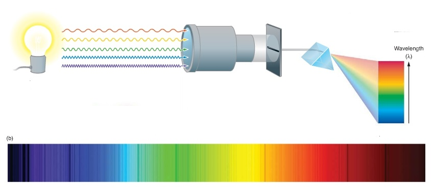
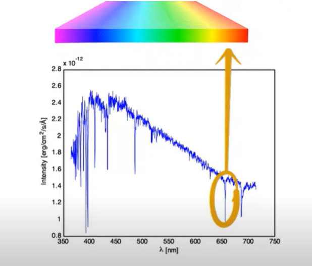

# Stellar Motion Detection through Spectral Shift Project (MATLAB)

## 1) PHYSICS BACKGROUND: The Science of Starlight and Spectroscopy

The ability to learn about stars, despite them being thousands of light years away, hinges on our understanding of light and its interaction with matter. 

The process starts by analyzing the light emitted by these distant stars, which travels across the space at Light Speed, covering approximately 9.46 trillion kilometers a year, for thousands of years before reaching us.

When this starlight arrives, it carries with it a wealth of information. To unlock this information, astronomers use a tool known as a diffraction grating. This device works on the principle of diffraction, bending and spreading out light into its component wavelengths or colors, akin to how a prism works or how water droplets split sunlight into a rainbow. The result of this diffraction is a spectrum - a band of colors ranging from red to violet, where each color corresponds to a different wavelength of light.

  

This spectrum is much more than a mere array of colors, it's filled with data about the star. The field of spectroscopy, which studies these spectra, allows astronomers to delve into the composition, temperature, and even the motion of stars. Each wavelength in the spectrum has a specific intensity or brightness, and by measuring these intensities across the spectrum, astronomers can infer a great deal about the star's properties.

One of the most telling features in a star's spectrum is the presence of dark lines or spikes at certain wavelengths. These are absorption lines, specific wavelengths where light has been absorbed by elements within the star. In the case of HD 94028, a star located in the constellation of Leo, a notable spike is observed around 650 nanometers, indicative of the presence of hydrogen, the most abundant element in stars. 

Hydrogen characteristically absorbs light at a wavelength of 656.3 nanometers, but in the spectrum of HD 94028, this absorption line is shifted slightly.

This shift is explained by the Doppler effect, a phenomenon more commonly associated with sound but equally applicable to light. This concept is similar to the experience of hearing a siren from an approaching or receding ambulance: the pitch sounds higher as it approaches and lowers as it moves away, due to the sound waves being compressed or stretched.

In the case of Light, when a star moves relative to us, the wavelengths of the light it emits are altered. If the star is moving away, the light is redshifted, meaning the absorption lines are observed at longer wavelengths. Conversely, if the star is approaching, the light is blueshifted, and the lines are seen at shorter wavelengths. 

  

In essence, the light from a star like HD 94028 is a cosmic messenger. By carefully analyzing this light, we can uncover the secrets of a star that lies thousands of light years away, learning not just about its current state, but also about its motion, hinting at the dynamic and ever-changing nature of our universe.

# 2) Star Data File Description

## File: `starData.mat`

This file contains data related to stellar observations and spectra analysis.

### Data Structure
- **`lambda`**: A variable representing wavelengths, stored as floating-point numbers (`float64`).
- **`spectra`**: Contains the spectral data, also in `float64` format.
- **`starnames`**: An array with the names of the 7 stars

## File: `Stellar_Motion_Detection_through_Spectral_Shift__MATLAB_CODE.m`

This file contains the MATLAB code used for the data analysis and visualization.

## File: `data_visualization_output.pdf`

This file contains the visual output of the analysis.

## Folder: `imgs`

This folder contains the images used in the README.md file.
